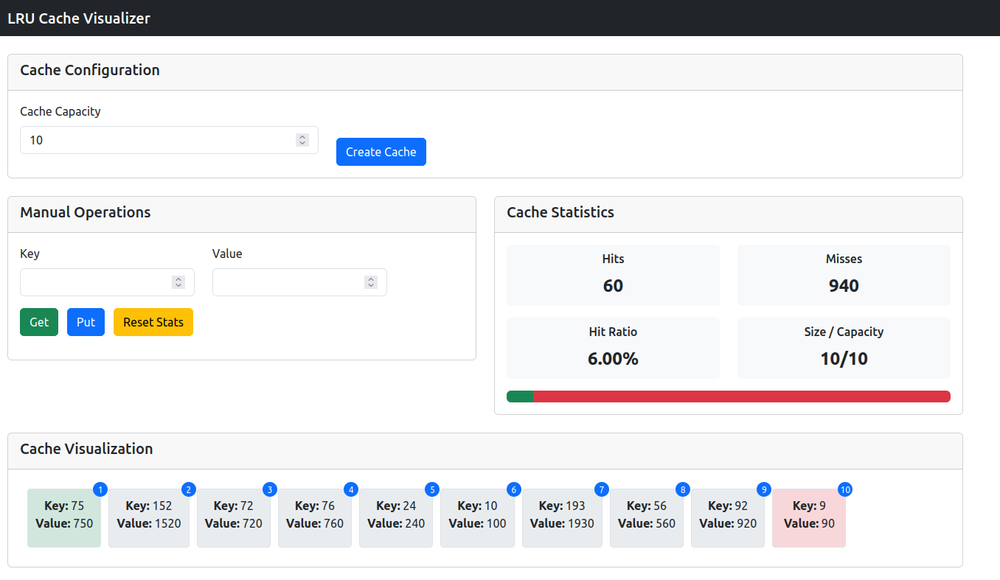

# LRU Cache Implementation

An efficient implementation of a Least Recently Used (LRU) Cache with interactive visualization. This project combines a high-performance C++ implementation with a Python Flask backend and web-based visualization.

## Overview

This LRU Cache implementation uses a hash table and doubly linked list to achieve O(1) time complexity for both get and put operations. The project includes:

- Core C++ implementation of the LRU cache data structure
- Python Flask backend API
- Interactive web-based visualization
- Performance analysis tools
- Realistic access pattern simulation



## Features

- **Efficient Implementation**: O(1) time complexity for both `get` and `put` operations
- **Interactive Visualization**: See the cache state update in real-time
- **Performance Analytics**: Track hit/miss ratio and visualize performance metrics
- **Simulation**: Run simulations with configurable parameters to see how the cache behaves
- **Zipfian Distribution**: Simulate realistic access patterns where some items are more frequently accessed
- **Performance Analysis**: Compare different cache sizes to see the impact on hit rate and access time

## Technical Details

### Core Data Structure

The LRU Cache is implemented using:
- A hash table (`std::unordered_map`) for O(1) key lookups
- A doubly linked list to maintain the order of items by recency of use

### Project Architecture

- **C++ Core**: Implements the LRU cache data structure
- **C-Python Interface**: Allows the Python code to interact with the C++ implementation
- **Flask Backend**: Provides API endpoints for the web interface
- **Web Frontend**: Visualizes the cache state and performance metrics

## Usage

### Prerequisites

- C++ compiler (with C++17 support)
- Python 3.6+
- Flask
- Make

### Running the Project

1. Clone the repository:
   ```bash
   git clone https://github.com/Saad-777/LRU-Cache.git
   cd LRU-Cache
